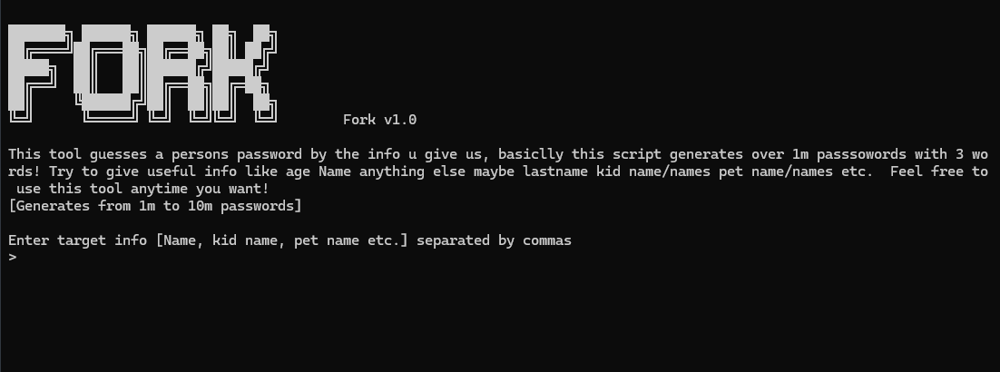

# FORK Password Generator v1.0



FORK is an educational password list generator designed to demonstrate how easily weak passwords can be guessed using personal information.

This tool generates 1,000,000 to 10,000,000+ password candidates from just a few clues.

---

## What this tool does

This tool guesses a person's password by the info you give it.  
Basically, this script generates over 1 million passwords with only 3 words!

Try to give useful info like:
- Name
- Age
- Last name
- Kid name(s)
- Pet name(s)
- Birth year
- Favorite words

Feel free to use this tool anytime you want!

---

## Features

- Smart mutations (leet, symbols, years, seasons, keyboard patterns)
- Combination engine
- Progress bar
- Desktop output
- Clean error handling
- Generates massive wordlists for security testing

---

## Usage

```bash
git clone https://github.com/darbom-yt/Fork.git
cd Fork
python fork.py