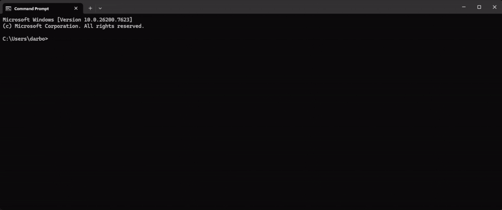

# FORK Password Guesser v1.0



FORK is an educational password guessing tool designed to demonstrate how easily weak passwords can be guessed using personal information.

This tool guesses 1,000,000 to 10,000,000+ password candidates from just a few clues.

---

## What this tool does

This tool guesses a person's password by the info you give it.  
Basically, this script guesses over 1 million passwords with only 3 words!

Try to give useful info like:
- Name  
- Age  
- Last name  
- Kid name(s)  
- Pet name(s)  
- Birth year  
- Favorite words  

Feel free to use this tool anytime you want!

> For educational and authorized testing purposes only.  
> Use only on systems you own or have permission to test.

---

## Features

- Smart guessing engine (leet, symbols, years, seasons, keyboard patterns)  
- Combination engine  
- Progress bar  
- Desktop output  
- Clean error handling  
- Guesses massive password lists for security testing  

---

## Usage

```bash
git clone https://github.com/darbom-yt/Fork.git
cd Fork
python fork.py
